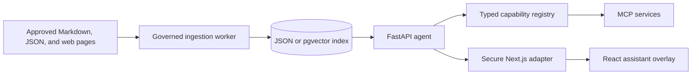
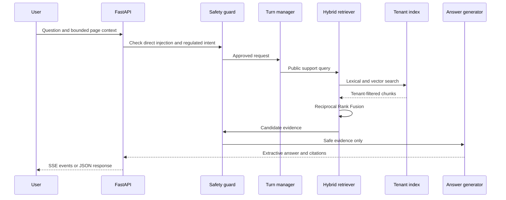
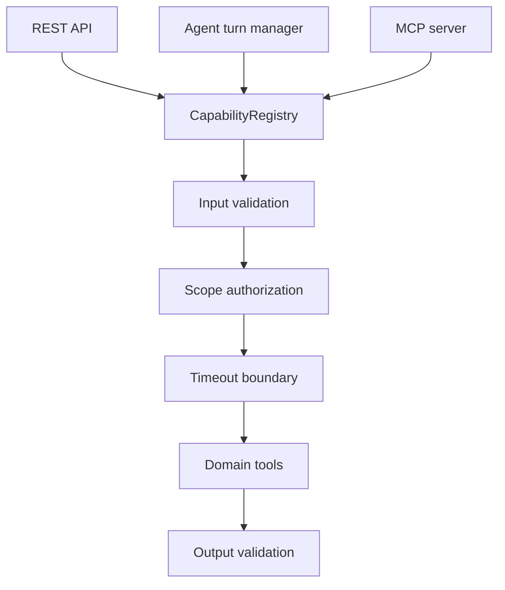

# Zappy-AI

> A grounded, safety-first support assistant built with hybrid RAG, typed agent capabilities, MCP, secure action confirmation, privacy-safe observability, and a reusable Next.js chat overlay.

Zappy-AI answers public support questions with citations, routes structured requests to validated tools, and refuses or escalates requests that cross its evidence or authorization boundaries. It is both an end-to-end AI engineering portfolio project and a reusable add-on for an existing Next.js monorepo.



## What It Can Do

| Area | Functionality | Implementation |
|---|---|---|
| Grounded support | Answers from approved evidence and returns source citations | BM25-style lexical retrieval, cosine vector retrieval, Reciprocal Rank Fusion, extractive answers |
| Safe fallback | Refuses unsupported or account-specific questions when evidence or authorization is missing | Answerability checks, access-level filtering, explicit refusal modes |
| Agent routing | Selects RAG, one tool, parallel tools, clarification, escalation, or blocking | Deterministic rule-first classifier and turn manager |
| Typed tools | Exposes 20 validated support, commerce, coverage, account, content, and smart-home capabilities | Pydantic contracts and a shared `CapabilityRegistry` |
| Parallel execution | Runs compatible plan and coverage requests concurrently | Structured concurrency with `asyncio.TaskGroup` |
| MCP | Makes the same capabilities discoverable over Streamable HTTP | FastMCP server plus an independently runnable Smart Home/Protect service |
| Browser chat | Streams answers, citations, suggestions, errors, and completion events | Framework-neutral TypeScript SDK and SSE parser |
| Voice interaction | Supports tap-to-talk transcription and selectable speech playback | Browser speech APIs with bounded capture and no audio upload |
| Reusable UI | Mounts a floating assistant over an existing site without replacing its pages | React widget, headless hook, and namespaced styles |
| Next.js integration | Proxies the assistant through a same-origin server route | Request validation, bounded context, server-derived tenant identity, streaming pass-through |
| Host-aware RAG | Indexes content explicitly approved by another monorepo | Markdown/MDX, JSON export, sitemap discovery, incremental checksums, deleted-page cleanup |
| Session security | Exchanges a local bootstrap token for an opaque browser session | Hashed tokens, secure cookies, expiry, CSRF checks, server-derived scopes |
| Sensitive actions | Requires an exact confirmation before executing a prepared action | Expiring session binding, idempotency, replay protection, metadata-only audit records |
| AI safety | Blocks direct prompt injection and instruction-shaped retrieved evidence | Input guard, evidence guard, regulated-request escalation, PII redaction |
| Observability | Records useful traces without storing raw conversations or account data | Bounded in-memory traces, OpenTelemetry-compatible IDs, allowlisted attributes |
| Evaluation | Measures retrieval, grounding, routing, safety, latency, and transcript WER | Versioned datasets and reproducible evaluation reports |
| CI security | Enforces quality and dependency controls | Ruff, Pyright, pytest, package audits, Gitleaks, frontend lint/test/build |

## See It Work

### 1. Install the project

Prerequisites:

- Python 3.11 or newer; CI uses Python 3.12
- Node.js with pnpm 10.23.0
- GNU Make or a compatible `make`

```bash
make bootstrap
```

### 2. Start the API and web app

Start the API:

```bash
make serve
```

In a second terminal, start the web application:

```bash
make serve-web
```

Open:

- Assistant: [http://localhost:3000](http://localhost:3000)
- OpenAPI: [http://localhost:8000/docs](http://localhost:8000/docs)
- Health check: [http://localhost:8000/health](http://localhost:8000/health)

The demo is intentionally a blank host canvas with the floating assistant. Zappy-AI is an overlay; it does not create or replace the host application's product pages.

### 3. Ask a grounded question

```bash
curl -s http://localhost:8000/api/chat \
	-H 'content-type: application/json' \
	-d '{"question":"How should I run a broadband speed test?"}'
```

The response contains an answer, citations, and retrieval metadata. Unsupported questions are refused rather than completed from model memory.

For incremental delivery, use the SSE endpoint:

```bash
curl -N http://localhost:8000/api/chat/stream \
	-H 'content-type: application/json' \
	-d '{"question":"What should I check when my broadband is slow?"}'
```

### 4. Exercise agent routing

Ask for two compatible tasks in one turn:

```bash
curl -s http://localhost:8000/api/agent/turn \
	-H 'content-type: application/json' \
	-d '{"question":"Compare broadband plans available at SW1A 1AA"}'
```

| Route mode | When it is used |
|---|---|
| `rag` | A public support question needs grounded evidence |
| `tool` | One high-confidence capability matches |
| `multi_tool` | Independent compatible capabilities can run concurrently |
| `clarification` | Required information, such as a postcode, is missing |
| `escalation` | A person is requested or the subject requires regulated support |
| `blocked` | The request triggers a safety policy |

### 5. Inspect and invoke typed capabilities

List all versioned capability contracts:

```bash
curl -s http://localhost:8000/api/capabilities
```

Invoke the synthetic account summary with the local bootstrap token:

```bash
curl -s http://localhost:8000/api/capabilities/account.summary \
	-H 'content-type: application/json' \
	-H 'authorization: Bearer demo-session' \
	-d '{}'
```

The registry validates input and output schemas, checks server-derived scopes, applies per-tool timeouts, and returns stable errors:

- `invalid_arguments`
- `unauthorized`
- `not_found`
- `timeout`
- `dependency_unavailable`
- `internal_error`

See the complete [MCP Tool Catalog](docs/mcp-tool-catalog.md) for all 20 capabilities and their data boundaries.

### 6. Run the MCP servers

Start the complete capability server:

```bash
make serve-mcp
```

It exposes Streamable HTTP at `http://127.0.0.1:8001/mcp`.

Start only the independently deployable Smart Home/Protect domain:

```bash
make serve-mcp-smarthome
```

It exposes `smart_home_protect.device_catalog` and `smart_home_protect.plan_catalog` at `http://127.0.0.1:8006/mcp`. Both return public catalogue information; live devices, policies, and claims are intentionally unavailable.

### 7. Refresh governed content

Build the local index from reviewed content:

```bash
make index
```

Fetch the explicitly approved public manifest:

```bash
make crawl-public
```

Review `data/crawled/sky-public.json`, including failures, before rebuilding the index. Crawl and rebuild in one command with:

```bash
make refresh-public
```

The crawler:

- accepts approved HTTPS hosts only;
- honors `robots.txt`;
- validates every redirect hop;
- blocks account, sign-in, checkout, quote, and claims paths;
- applies pacing, retries, response-size limits, and content-quality checks;
- never replaces a valid index after a failed refresh.

## How Grounded Answers Work



### Retrieval design

The local `HashingEmbedder` creates deterministic 384-dimensional vectors. This keeps tests fast, offline, and reproducible. It is an adapter boundary, not a claim of production-grade semantic quality.

Lexical and vector scores are ranked independently and combined with Reciprocal Rank Fusion. Their raw values are never added directly because they have different scales. Retrieval is filtered by `site_id` and access level before answering; current-page context receives only a bounded relevance boost.

### Grounding contract

- Answers are extracted from retrieved evidence.
- Claims include citations to approved sources.
- Instruction-shaped evidence is removed before generation.
- Missing evidence produces an explicit refusal.
- Browser-provided page context can influence relevance, never identity or authorization.

## Capability Architecture

`CapabilityRegistry` is the single invocation boundary for REST, the agent, and MCP:



The included tools cover:

- public article search, service status, speed-test, cancellation, and PIN guidance;
- synthetic plan comparison, current offers, and bundle configuration using exact `Decimal` totals;
- postcode validation and links to official coverage or store-locator experiences;
- authenticated synthetic account, billing, package, order, mobile, moving-home, and VIP records;
- public content search and Smart Home/Protect catalogues.

All commerce and account records are clearly marked synthetic fixtures. Coverage validates requests but never claims live service availability.

## Security Model

Zappy-AI treats browser input, retrieved content, and tool requests as separate trust boundaries.

| Control | Behavior |
|---|---|
| Prompt-injection guard | Evaluates direct injection before routing, preventing blocked requests from selecting tools |
| Evidence guard | Removes retrieved chunks containing instruction-shaped content |
| PII redaction | Sanitizes allowed string telemetry attributes before storage |
| Opaque sessions | Stores SHA-256 token and CSRF hashes rather than raw browser tokens |
| Secure cookies | Uses 30-minute `Secure`, `HttpOnly`, `SameSite=Strict` session cookies |
| CSRF validation | Requires `X-CSRF-Token` for mutating cookie-authenticated requests |
| Server-derived scopes | Ignores browser claims about identity or authorization |
| Action confirmation | Binds expiring pending actions to the session and idempotency key |
| Same-origin adapter | Rejects cross-origin browser requests and caps request size |
| Tenant isolation | Injects `siteId` server-side and filters retrieval by the matching tenant |

The demo bearer token and in-memory stores are development mechanisms, not production authentication. Read [Security and Privacy](docs/security-and-privacy.md) for the threat model and production replacement requirements.

## Privacy-Safe Observability

The in-memory recorder retains at most 200 traces and loses them on restart. Traces use OpenTelemetry-compatible identifiers and record only allowlisted operational metadata such as route mode, capability, engine, result count, grounding outcome, duration, and status.

It deliberately does not record:

- raw questions or transcripts;
- tool arguments or account records;
- secrets, cookies, tokens, or authorization headers;
- microphone audio.

A production exporter can preserve the same schema while sending traces to an OpenTelemetry backend.

## Evaluation and Quality Gates

Run the complete validation suite:

```bash
make check
```

Or run each layer independently:

```bash
make lint
make typecheck
make audit
make test
make evaluate
make web-check
```

| Evaluation | What it measures |
|---|---|
| Retrieval | Recall@5 and Mean Reciprocal Rank |
| Grounding | Citation precision and answerability accuracy |
| Routing | Route-mode and exact capability-selection accuracy |
| Safety | Injection blocking and escalation decisions |
| Latency | p50, p95, and p99 classifier and safety latency |
| Voice pipeline | Word error rate over fixed checked-in transcript fixtures |

The WER fixture verifies the metric pipeline; it does not measure a live browser microphone or external speech-recognition provider. Reports are written to `evaluations/results/`.

CI runs Python linting, type checking, tests, both evaluation suites, Python and pnpm dependency audits, frontend lint/test/build, and secret scanning. Deployment is intentionally outside the completed prototype scope.

## Reusable Next.js Add-On

The browser integration is split by responsibility:

| Package | Responsibility |
|---|---|
| `@zappy-ai/client-sdk` | Framework-neutral contracts, SSE parsing, cancellation, and page context |
| `@zappy-ai/react-assistant` | Floating `AssistantWidget`, headless `useAssistant` hook, voice UI, and styles |
| `@zappy-ai/next-adapter` | Same-origin validation, bounded parsing, tenant injection, and SSE proxying |

The host owns its routes, authentication, content, and visual design. It mounts the widget once and supplies only bounded navigation context. See [Next.js Add-on Integration](docs/nextjs-addon.md) for workspace installation and code examples.

These packages currently distribute TypeScript source for local workspace use. They are not yet prepared as public npm artifacts with compiled JavaScript, declaration output, release automation, provenance, and clean-tarball verification.

## Index Another Monorepo

Zappy-AI can build an authoritative tenant-specific index from sources approved by a host repository:

- Markdown and MDX with required frontmatter;
- a host-generated JSON export from typed page data or a CMS;
- same-origin pages discovered through a sitemap.

```bash
zappy-host-index --config zappy.config.json
```

Successful refreshes reuse unchanged embeddings, regenerate changed documents, remove deleted documents, and atomically replace the previous index. Any source-validation or approved-page fetch failure aborts the replacement.

React component source is not treated as reliable page content. Dynamic pages should export final assistant-safe text from the same typed data or CMS source used to render the page. Follow [Host Monorepo RAG Integration](docs/host-monorepo-integration.md) and start with the [example host configuration](examples/host-monorepo/zappy.config.json).

## Repository Map

```text
Zappy-AI/
├── apps/web/                         Blank Next.js host plus assistant overlay
├── data/curated/                     Reviewed public support fixtures
├── docs/                             Architecture, security, and integration guides
├── evaluations/                      Versioned datasets, evaluators, and reports
├── examples/host-monorepo/           Host indexing configuration example
├── infra/migrations/                 pgvector and host-source database migrations
├── packages/python/zappy_common/     Shared RAG models and embeddings
├── packages/typescript/client-sdk/   Typed streaming browser client
├── packages/typescript/next-adapter/ Secure Next.js proxy adapter
├── packages/typescript/react-assistant/ Floating widget and headless React hook
├── services/api/                     FastAPI RAG, agent, tools, auth, and traces
├── services/mcp/                     Independently deployable MCP services
├── tests/                            Contract and end-to-end journeys
└── workers/content_ingestion/        Crawling, cleaning, chunking, and indexing
```

## Storage Options

Local development reads `data/index/chunks.json`, keeping tests and demonstrations independent of cloud credentials.

For Supabase/PostgreSQL, apply:

- [001_rag_chunks.sql](infra/migrations/001_rag_chunks.sql) for vector, full-text, and row-level-security foundations;
- [002_host_rag_sources.sql](infra/migrations/002_host_rag_sources.sql) for host-aware source metadata.

Only the ingestion environment should receive `DATABASE_URL`. Browser code must never receive a service-role key.

## Repository Roadmap

The implementation is designed to be learned and merged in small dependency-ordered pull requests:

1. Repository tooling and shared Python contracts
2. Deterministic embeddings and curated content loading
3. Chunking, governed crawling, and local indexing
4. FastAPI, hybrid retrieval, grounded answers, and pgvector
5. Typed capabilities, routing, MCP, and action security
6. Safety, observability, evaluation, and CI
7. TypeScript SDK, React widget, Next.js adapter, and host-aware RAG

Tests belong in the PR that introduces each behavior, keeping every merge independently reviewable.

## Documentation

| Guide | Use it for |
|---|---|
| [Architecture](docs/architecture.md) | Components, trust boundaries, retrieval, agent flow, and observability |
| [Local Development](docs/local-development.md) | Setup, commands, API calls, indexing, and evaluation |
| [MCP Tool Catalog](docs/mcp-tool-catalog.md) | All tool contracts, inputs, and data boundaries |
| [Security and Privacy](docs/security-and-privacy.md) | Threat model, session controls, privacy, and production gaps |
| [Next.js Add-on Integration](docs/nextjs-addon.md) | Mounting the widget and creating the server adapter |
| [Host Monorepo RAG Integration](docs/host-monorepo-integration.md) | Indexing approved content from another repository |

## Prototype Boundaries

Zappy-AI is an educational prototype, not a production Sky service.

- It is not affiliated with or endorsed by Sky.
- It uses public information and reviewed development fixtures only.
- It has no access to live customer, billing, policy, device, claims, or availability systems.
- Account and commerce records are synthetic.
- Sensitive actions demonstrate secure workflow mechanics but do not mutate real accounts.
- Local embeddings prioritize deterministic testing over semantic quality.
- Production requires approved data connectors, hosted or versioned embeddings, durable encrypted stores, OIDC authorization code with PKCE, revocation, rate limiting, distributed telemetry, and an operational deployment design.

## Project Principles

1. **Ground claims in approved evidence.** Refuse when evidence is insufficient.
2. **Keep identity on the server.** Browser context is never an authorization source.
3. **Validate every tool boundary.** Inputs, scopes, timeouts, outputs, and errors are explicit.
4. **Make unsafe behavior testable.** Injection, escalation, citation, and routing rules have versioned evaluations.
5. **Let the host own the product.** The assistant augments existing pages instead of replacing them.
6. **Be honest about demonstrations.** Synthetic data and non-production controls are labeled as such.

---

Built as an independent AI engineering portfolio project using public information. Start with [Local Development](docs/local-development.md), then explore the system through the OpenAPI interface, floating assistant, and MCP tool catalog.
