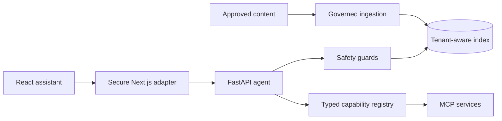

# Zappy AI: Purpose and Feature Ideation

## 1. Project Purpose

Zappy AI is a grounded, safety-first customer-support assistant. Its purpose is to demonstrate how an AI assistant can answer support questions, discover products, use structured tools, and guide authenticated users without inventing facts or crossing security boundaries.

The project is designed around a practical problem: a normal chatbot can produce convincing answers even when its information is outdated, incomplete, or unrelated to the user. A useful support assistant must do more than generate text. It must know which sources it can trust, show where an answer came from, recognize when it lacks evidence, validate every action, and protect account data.

Zappy AI therefore combines:

- grounded retrieval from approved content;
- deterministic agent routing;
- typed business capabilities;
- secure session and action workflows;
- a reusable browser assistant;
- privacy-safe observability and measurable evaluations.

It is an educational and portfolio-quality prototype. It uses public information and synthetic customer, commerce, and account records. It does not connect to or change real customer accounts.

## 2. The Problem It Solves

Customer-support information is usually spread across help articles, product pages, account systems, service checkers, and specialist teams. A user should not need to know which system contains the answer or repeat the same request across several channels.

Zappy AI explores a single conversational entry point that can:

1. Find reliable information from approved sources.
2. Explain that information with citations.
3. Choose a validated tool when information retrieval is not enough.
4. Ask for missing details instead of guessing.
5. Escalate requests that require a person or regulated support.
6. Refuse requests that are unsafe or outside its evidence and authorization.
7. Require explicit confirmation before a sensitive action.

The goal is not to make the AI appear all-knowing. The goal is to make its limits visible, predictable, and safe.

## 3. Intended Users

### Customers

Customers receive faster answers, source links, relevant product guidance, and a consistent interface across a website. They can use text or voice and can be directed to a human when automation is unsuitable.

### Support and Product Teams

Support teams gain a structured way to expose approved knowledge and business operations. Product teams can add the assistant to an existing Next.js application without replacing its pages, authentication, or design system.

### AI and Platform Engineers

Engineers can use the project as a reference architecture for hybrid RAG, agent routing, MCP tools, secure action confirmation, tenant isolation, observability, and evaluation.

## 4. Core Design Principles

### Ground claims in evidence

An answer should come from approved content and include citations. If sufficient evidence is unavailable, the assistant should refuse or ask for clarification rather than answer from unsupported model memory.

### Keep authority on the server

The browser can supply navigation context, but it cannot decide the user's identity, permissions, tenant, or account scope. Those values must come from trusted server-side state.

### Treat tools as contracts

Every capability has a defined input schema, output schema, authorization requirement, timeout, and stable error behavior. This makes tool execution testable and prevents the agent from passing arbitrary values into business operations.

### Separate information from action

Reading an article is low risk. Changing a package, making a payment, or cancelling a service is not. Sensitive actions must use a separate prepare-and-confirm flow with explicit user consent.

### Make safety measurable

Prompt-injection blocking, escalation, retrieval, citations, routing, latency, and voice transcription are evaluated through versioned datasets instead of being treated as subjective claims.

### Integrate without taking over the host product

Zappy AI is an add-on. The host application continues to own its routes, content, identity, and visual design. The assistant adds a conversational layer over the existing product.

## 5. Implemented Features: Why and How

### 5.1 Grounded Support Answers

**Purpose:** Answer public support questions using evidence that the project is allowed to use.

**Why it exists:** A fluent answer is not necessarily a correct answer. Customer support requires traceability, especially when guidance affects connectivity, billing, cancellation, or account access.

**How it works:** Approved documents are cleaned, divided into chunks, embedded, and stored in an index. At question time, the retriever finds relevant chunks, the evidence guard removes unsafe material, and the answer generator extracts an answer from the remaining evidence. The response includes source citations and retrieval metadata.

### 5.2 Hybrid RAG Retrieval

**Purpose:** Find relevant information when a question contains either exact support terminology or broader semantic meaning.

**Why it exists:** Keyword search is strong for exact terms such as product names and error messages, while vector search is useful when the user describes the same idea with different words. Either method alone can miss useful evidence.

**How it works:** Zappy AI independently ranks chunks using BM25-style lexical retrieval and cosine vector similarity. It combines the two ranked lists with Reciprocal Rank Fusion. Raw lexical and vector scores are not added because they use different scales.

The local `HashingEmbedder` produces deterministic 384-dimensional vectors. This keeps development and evaluation reproducible and provides a clean boundary where a production embedding model can later be connected.

### 5.3 Citations and Answerability Checks

**Purpose:** Let users inspect the evidence behind an answer and prevent unsupported responses.

**Why it exists:** Citations improve trust only when they genuinely support the claims being made. An assistant also needs a defined behavior for questions that are outside its knowledge base.

**How it works:** The answer generator maps extracted statements to retrieved source chunks. Answerability checks verify that suitable public evidence exists. When it does not, the assistant returns an explicit refusal or escalation rather than generating a speculative answer.

### 5.4 Tenant and Access-Level Isolation

**Purpose:** Ensure that each host website retrieves only its own approved content and that public requests cannot access protected material.

**Why it exists:** A reusable assistant may serve several sites. Mixing content between tenants or exposing account-specific information through public retrieval would be a serious security and privacy failure.

**How it works:** Documents and chunks carry a `site_id` and access level. The server derives the tenant and filters retrieval before answering. Browser-provided page context can give the current page a bounded relevance boost, but it cannot change tenant identity or authorization.

### 5.5 Deterministic Agent Routing

**Purpose:** Decide whether a request needs knowledge retrieval, a business capability, clarification, escalation, or blocking.

**Why it exists:** Sending every request to an unconstrained model makes behavior difficult to predict and test. Support workflows need reliable decisions, especially around tools and sensitive topics.

**How it works:** A rule-first classifier and turn manager assign one of these route modes:

- `rag` for grounded public-support questions;
- `tool` for one high-confidence capability;
- `multi_tool` for independent compatible capabilities;
- `clarification` when required information is missing;
- `escalation` when a person or regulated support is needed;
- `blocked` when a safety rule is triggered.

Direct prompt-injection checks run before routing so a blocked request cannot select or invoke a tool.

### 5.6 Parallel Tool Execution

**Purpose:** Complete independent parts of a request with lower total latency.

**Why it exists:** A request such as comparing plans and checking coverage contains tasks that do not depend on each other. Running them one after another makes the user wait unnecessarily.

**How it works:** The turn manager identifies compatible capabilities and executes them concurrently with Python's `asyncio.TaskGroup`. Each invocation still passes through the same validation, authorization, timeout, and output checks.

### 5.7 Typed Capability Registry

**Purpose:** Provide one controlled execution boundary for all business tools.

**Why it exists:** REST endpoints, the agent, and MCP should not implement different validation or authorization logic. A shared boundary prevents behavior and schema drift.

**How it works:** The `CapabilityRegistry` stores versioned capability definitions. Pydantic models validate input and output, server-derived scopes control access, per-tool timeouts bound execution, and failures use stable error codes such as `invalid_arguments`, `unauthorized`, `not_found`, `timeout`, `dependency_unavailable`, and `internal_error`.

### 5.8 Twenty Support and Product Capabilities

**Purpose:** Demonstrate that one assistant can safely cover several support domains without treating every operation as free-form text generation.

**Why it exists:** Real support journeys combine information discovery and structured operations. Typed tools make those operations explicit and auditable.

**How it works:** The current registry includes:

- support article search, service-status guidance, speed-test guidance, cancellation guidance, and PIN/ID guidance;
- plan comparison, current offers, and bundle configuration with exact `Decimal` totals;
- postcode validation, coverage guidance, and store-location links;
- synthetic account summary, billing, package, order, mobile usage, moving-home, and VIP records;
- public content search and Smart Home/Protect catalogues.

Account and protected support capabilities require authentication. Commerce and account responses are synthetic. Coverage validates the request but does not claim live availability because no approved live API is connected.

### 5.9 Model Context Protocol Support

**Purpose:** Make Zappy AI capabilities discoverable and callable by standards-compatible AI hosts.

**Why it exists:** Business capabilities should not be locked to one frontend or one agent implementation. MCP provides a standard way to describe and invoke tools.

**How it works:** A FastMCP server exposes the registry over Streamable HTTP. MCP calls delegate to the same `CapabilityRegistry` used by REST and the internal agent. The Smart Home/Protect domain is also packaged as an independently deployable MCP service, demonstrating how domains can be separated without duplicating contracts.

### 5.10 Streaming Browser Chat

**Purpose:** Give users immediate progress and incremental responses instead of waiting for a complete server result.

**Why it exists:** Retrieval and tool execution can take time. Streaming makes the interface feel responsive and allows errors, citations, suggestions, and completion state to arrive as structured events.

**How it works:** FastAPI exposes Server-Sent Events endpoints. The framework-neutral TypeScript client parses the stream and handles answer events, metadata, errors, completion, and cancellation.

### 5.11 Reusable React Assistant

**Purpose:** Add the assistant to an existing web application without rebuilding that application's pages.

**Why it exists:** A support assistant is more useful when it can be integrated into an established product with minimal disruption. The host should retain control of branding, navigation, and page ownership.

**How it works:** The `@zappy-ai/react-assistant` package provides a floating `AssistantWidget`, namespaced styles, voice controls, suggestions, citations, and interaction states. A headless `useAssistant` hook is available when the host needs a completely custom interface.

### 5.12 Secure Next.js Adapter

**Purpose:** Keep browser traffic same-origin and protect upstream service credentials and tenant configuration.

**Why it exists:** A browser must never receive backend service tokens or be trusted to choose its own tenant. Direct cross-origin calls also make request validation and host integration harder to control.

**How it works:** The `@zappy-ai/next-adapter` package creates a Next.js server route that validates origin, question shape, request size, and allowlisted page context. It injects `siteId` and upstream authorization server-side, then proxies SSE responses without buffering them.

### 5.13 Page-Aware Assistance

**Purpose:** Make suggestions and retrieved answers more relevant to the page the user is viewing.

**Why it exists:** A user on a broadband page probably has different needs from a user on a Smart Home page. Navigation context can improve relevance without collecting the page's entire DOM or private state.

**How it works:** The host explicitly supplies bounded fields such as pathname, title, and section. This context may influence retrieval ranking and UI suggestions. It is treated only as navigation metadata and never as identity, authorization, or direct tool arguments.

### 5.14 Voice Input and Speech Playback

**Purpose:** Provide a more accessible, hands-free way to use the assistant.

**Why it exists:** Typing is not always convenient or accessible. Spoken interaction can reduce friction for short support questions and let users listen to an answer.

**How it works:** The React package uses browser speech APIs for tap-to-talk transcription and selectable text-to-speech playback. Capture is bounded, and the current client does not upload microphone audio to the Zappy API.

### 5.15 Governed Content Ingestion

**Purpose:** Build a knowledge index from content that has been explicitly approved for assistant use.

**Why it exists:** Retrieval quality and safety begin before a user asks a question. Crawling arbitrary pages could ingest private areas, low-quality text, prompt injection, or content the assistant is not authorized to use.

**How it works:** The ingestion worker accepts reviewed Markdown/MDX, structured JSON exports, and same-origin sitemap pages. Remote crawling requires HTTPS, honors `robots.txt`, validates redirects, restricts hosts and paths, applies pacing and response limits, and checks content quality. Account, sign-in, checkout, quote, and claims paths are blocked.

### 5.16 Incremental and Atomic Index Refresh

**Purpose:** Keep host knowledge current without rebuilding every document or damaging a valid index after a failed refresh.

**Why it exists:** Content changes over time, but unnecessary re-embedding wastes resources. A partial or failed crawl must not replace a working production index.

**How it works:** Checksums identify unchanged documents so their chunks and embeddings can be reused. Changed documents are regenerated, deleted documents are removed, and the new index replaces the previous one only after all source validation and approved-page fetching succeeds.

### 5.17 Prompt-Injection and Evidence Guards

**Purpose:** Prevent users or retrieved pages from overriding system rules and triggering unsafe behavior.

**Why it exists:** Both direct input and external content are untrusted. A page can contain text that looks like an instruction to an AI, and a malicious user can try to bypass policies.

**How it works:** The input guard checks direct injection before route selection. The evidence guard removes retrieved chunks containing instruction-shaped material before answer generation. Regulated requests are sent to explicit human escalation paths.

### 5.18 Secure Browser Sessions

**Purpose:** Demonstrate how authenticated browser access can be separated from public support access.

**Why it exists:** Protected account tools need identity and scopes, but raw tokens should not be exposed to browser JavaScript or stored in logs.

**How it works:** The local session endpoint exchanges a development bootstrap token for a random opaque session. The server stores SHA-256 token and CSRF hashes, applies a 30-minute expiry, and sets `Secure`, `HttpOnly`, `SameSite=Strict` cookies. Mutating cookie-authenticated requests require a matching CSRF token. Permissions are read from server-side session state.

This is a demonstration mechanism. Production use requires OIDC authorization code flow with PKCE, token validation, rotation, revocation, and durable encrypted session storage.

### 5.19 Sensitive Action Confirmation

**Purpose:** Ensure that consequential operations cannot happen because of an ambiguous conversational request or repeated network call.

**Why it exists:** A user may ask about cancellation without intending to cancel. AI interpretation alone is not sufficient consent for payments, package changes, cancellations, claims, or similar operations.

**How it works:** The API separates preparation from confirmation. A prepared action expires, is bound to the authenticated session and an idempotency key, and requires an exact confirmation phrase. Replay protection prevents the same action from being executed repeatedly. The prototype records metadata-only audit entries and does not mutate real accounts.

### 5.20 Privacy-Safe Observability

**Purpose:** Make system behavior diagnosable without turning telemetry into a store of customer conversations and secrets.

**Why it exists:** Teams need latency, routing, grounding, and failure data to operate an assistant. Recording raw questions, transcripts, account records, tokens, or tool arguments would create unnecessary privacy and security risk.

**How it works:** The recorder uses OpenTelemetry-compatible trace and span identifiers and accepts only allowlisted attributes such as route mode, capability, engine, grounding outcome, result count, duration, and status. String attributes pass through PII redaction, and session correlation values are hashed. The development recorder retains at most 200 traces in memory.

### 5.21 Evaluation Framework

**Purpose:** Verify that retrieval, routing, safety, and performance improve without relying on visual demos or anecdotal prompts.

**Why it exists:** AI behavior can regress when prompts, policies, data, or models change. Versioned evaluations provide repeatable evidence about the system's actual behavior.

**How it works:** Checked-in datasets measure:

- retrieval Recall@5 and Mean Reciprocal Rank;
- citation precision and answerability accuracy;
- route-mode and exact capability-selection accuracy;
- injection blocking and escalation decisions;
- p50, p95, and p99 classifier and safety latency;
- word error rate over fixed voice transcript fixtures.

The voice fixture tests the metric pipeline; it is not a claim about a live speech-recognition provider.

### 5.22 Automated Quality and Security Gates

**Purpose:** Keep the Python, TypeScript, dependency, and secret-management surfaces consistently verifiable.

**Why it exists:** A safety-oriented architecture is only credible when its contracts and controls are continuously tested.

**How it works:** CI runs Ruff, Pyright, pytest, frontend linting, Vitest, production builds, both evaluation suites, Python and pnpm dependency audits, and Gitleaks secret scanning. Contract and end-to-end tests verify behavior across service boundaries.

## 6. Architecture Summary

The architecture separates content ingestion, retrieval, routing, capability execution, browser integration, and security controls. Each boundary can be tested or replaced independently. For example, a hosted embedding model can replace the deterministic local embedder without changing the browser widget or capability registry.

## 7. What Makes the Project Different

Zappy AI is not only a chat interface over an LLM. Its main distinction is the combination of grounding, explicit capability contracts, security boundaries, and reusable integration.

- It shows sources instead of hiding where information came from.
- It refuses unsupported questions instead of presenting guesses as facts.
- It distinguishes public knowledge from authenticated operations.
- It validates tools through one shared registry across REST, agents, and MCP.
- It treats retrieved content as untrusted input.
- It requires explicit confirmation for sensitive actions.
- It can be installed over an existing Next.js application without taking ownership of that application.
- It measures retrieval, routing, safety, latency, and grounding through reproducible evaluations.

## 8. Current Prototype Boundaries

The following limitations are intentional and should remain visible:

- The project is not affiliated with or endorsed by Sky.
- It uses public information and reviewed development fixtures.
- Account and commerce records are synthetic.
- It has no live customer, billing, device, policy, claims, or availability connection.
- Prepared actions demonstrate workflow security but do not change real accounts.
- Local embeddings optimize for deterministic tests rather than production semantic quality.
- Sessions, pending actions, and traces use in-memory development storage.
- The TypeScript packages are workspace packages, not production-ready public npm releases.

These boundaries prevent the demo from claiming access, accuracy, or operational authority that it does not have.

## 9. Future Feature Ideas

### Production identity and account integration

Replace the bootstrap session with OAuth/OIDC and PKCE, then connect narrowly scoped customer APIs. Each connector should preserve server-derived scopes, confirmation, audit, revocation, and data-minimization rules.

### Human-agent handoff

Create a support case and transfer a user to the correct team when the assistant escalates. The user should control whether a conversation summary is shared.

### Live service and coverage data

Connect approved real-time APIs so the assistant can report outages and availability with timestamps, clear source attribution, and graceful fallback behavior.

### Multilingual support

Add language detection, translated approved content, locale-aware retrieval, and evaluation datasets for every supported language rather than relying only on model translation.

### Image and document assistance

Allow users to submit router-light photos, screenshots, or bills through a consent-based, size-limited workflow with malware scanning, redaction, retention limits, and accessible alternatives.

### Feedback and content improvement

Add answer ratings, citation issue reporting, and a review queue. Feedback should improve approved content and evaluation datasets rather than automatically training on unreviewed customer messages.

### Operational administration

Provide a protected dashboard for source health, failed ingestion, weak retrieval queries, capability errors, safety events, evaluation trends, and content approval.

### Production reliability

Add durable encrypted stores, distributed tracing, rate limiting, abuse prevention, caching, connector circuit breakers, deployment automation, and service-level objectives.

## 10. Definition of Success

Zappy AI succeeds when it can help a user reach a correct and appropriate outcome while remaining honest about its evidence, permissions, and limitations.

Success is not measured only by how many questions receive an answer. It is also measured by whether the system:

- retrieves the correct approved evidence;
- cites that evidence accurately;
- selects the correct capability;
- asks for missing information;
- blocks unsafe instructions;
- escalates at the right time;
- protects customer and tenant data;
- avoids unintended actions;
- integrates cleanly into an existing product;
- remains observable and testable without collecting unnecessary personal data.

That combination of usefulness, restraint, and engineering transparency is the central idea behind Zappy AI.